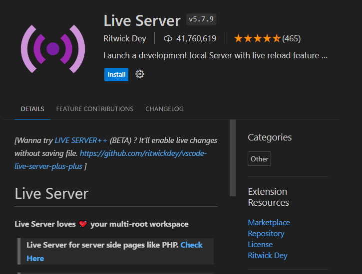
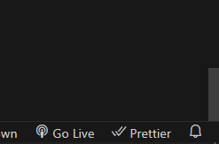

<h1 align="center"> DevLinks </h1>

<p align="center">
  <a href="#-tecnologias">Tecnologias</a>&nbsp;&nbsp;&nbsp;|&nbsp;&nbsp;&nbsp;
  <a href="#-projeto">Projeto</a>&nbsp;&nbsp;&nbsp;|&nbsp;&nbsp;&nbsp;
  <a href="#-layout">Layout</a>&nbsp;&nbsp;&nbsp;|&nbsp;&nbsp;&nbsp;
  <a href="#gear-rodando-o-projeto">Rodando o Projeto</a>&nbsp;&nbsp;&nbsp;|&nbsp;&nbsp;&nbsp;
  <a href="#memo-licença">Licença</a>
</p>

<p align="center">
  
</p>

## 🚀 Tecnologias

Esse projeto foi desenvolvido com as seguintes tecnologias:

- HTML e CSS
- JavaScript
- Git e Github
- Figma

## 💻 Projeto

O DevLinks é um agregador de links para usar como cartão de visitas online.

## :gear: Rodando o Projeto

Caso não tenha o VSCode instalado, sugiro que o utilize para seguir todas as etapas a seguir. Utilize este [link](https://code.visualstudio.com/download) do site oficial para baixar o VSCode na sua máquina.

No terminal, aberto na pasta que baixará o projeto, clone-o para sua máquina:

```
$ git clone https://github.com/nunesd66/linktree-rocketseat.git
```

Depois Abra o projeto no VSCode:

```
$ cd linktree-rocketseat/
```
```
$ code .
```

No VSCode, na parte de extensões (Atalho: Ctrl + Shift + X), procure e baixe a extensão [Live Server](https://github.com/ritwickdey/vscode-live-server-plus-plus).
<p align="start">
  
</p>
Após instalada, aparecerá no canto inferior direito do editor VSCode o ícone do Liver Server, escrito Go Live. Basta clicar para visualizar o projeto funcionando. Abrirá uma janela no navegador.
<p align="start">
  
</p>

## 🔖 Layout

Você pode visualizar o layout do projeto através [DESSE LINK](<https://www.figma.com/file/qckXTrd5KAafP3U26lUM1J/DevLinks-%E2%80%A2-Projeto-Discover-(Community)?type=design&t=2H9Un3EF3q4c1hgc-6>). É necessário ter conta no [Figma](https://figma.com) para acessá-lo.

## :memo: Licença

Esse projeto está sob a licença MIT.

---
<p align="center">
by [Rocketseat](https://www.rocketseat.com.br/), alterado por [nunesd66](https://github.com/nunesd66).
</p>
